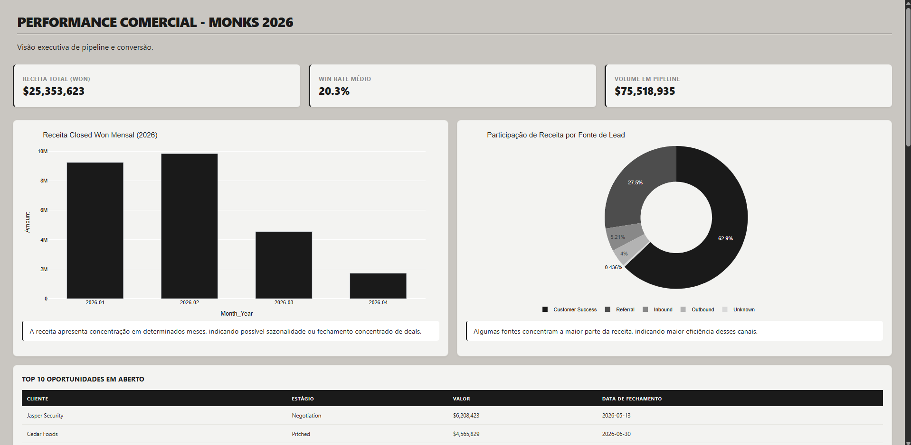
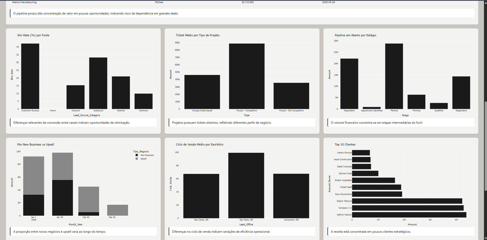

# 📊 Performance Comercial Dashboard & Auditor
> **Pipeline automatizado de limpeza de dados e visualização estratégica de performance comercial.**


**Link para o Dashboard e Relatório de Auditoria:** [Modo Live do Projeto](https://mateuslima909.github.io/case-monks/)

## 📖 Sobre o Projeto

Este projeto foi desenvolvido como uma solução técnica completa para o gerenciamento e análise de dados de CRM. Ele ataca diretamente o problema de **"dados sujos"** que frequentemente distorcem as métricas de Sales Operations, impedindo uma tomada de decisão segura.

O ecossistema consiste em um pipeline de **Data Quality** que audita bases corrompidas, corrige divergências financeiras e gera automaticamente um dashboard executivo interativo com os principais KPIs de venda.

### ✨ Funcionalidades Principais

* **Auditoria Automatizada:** Identifica inconsistências em cidades, estágios de venda e taxonomia de fontes de lead.
* **Recálculo Financeiro:** Corrige o valor total das oportunidades (`Amount`) com base na soma real dos produtos, eliminando erros de input manual.
* **Dashboard Executivo:** Visualização de 10 métricas críticas, incluindo Win Rate, Receita MoM, Ciclo de Venda e Mix de Negócios (New Business vs Upsell).
* **Relatórios de Erros:** Geração de um arquivo HTML (`relatorio_erros.html`) com badges de status para facilitar a identificação de registros que precisam de correção no CRM.
* **Layout Híbrido:** Design responsivo com destaques para métricas de receita e grade de detalhes para métricas operacionais.

---

## 📸 Screenshots

|||
|:---:|:---:|
|**Destaque (Receita e Fontes)**|**Métricas de Conversão e Pipeline**|

---

## 🛠️ Tecnologias Utilizadas

* **Linguagem:** Python
* **Processamento de Dados:** Pandas (Deduplicação, Normalização e lógica de ETL)
* **Visualização Interativa:** Plotly Express (Gráficos dinâmicos e responsivos)
* **Relatórios:** HTML5 & CSS3 (Layout de Grid customizado)
* **Manipulação de Arquivos:** OpenPyXL (Leitura e escrita de Excel)

---

## 🗺️ Contexto de Negócio (Insights)

O projeto vai além do código, entregando inteligência para a liderança:
* **Eficiência de Canais:** Identificamos que a fonte *Referral* possui o maior Win Rate, sugerindo uma estratégia focada em parcerias.
* **Saúde do Pipeline:** O dashboard revela \$75M em volume total, mas com concentração em estágios iniciais, alertando para a necessidade de aceleração de deals.
* **Data Quality:** A automação identificou e filtrou registros com cidades fora do padrão e estágios inválidos, elevando a confiabilidade da base para 100%.

---

## 🚀 Como Executar o Projeto

### Estrutura de Pastas
Para o funcionamento correto, mantenha a estrutura:
`data/raw` (original), `data/processed` (processado) e `reports` (saídas).

### Passo a Passo

1. **Clone o repositório:**
   ```bash
   git clone https://github.com/MateusLima909/case-monks.git
   cd case-monks
   ```

2. **Instale as dependências:**
   ```bash
   pip install pandas plotly openpyxl
   ```

3. **Execute a Limpeza e Auditoria:**
   ```bash
   python src/limpeza.py
   ```
   * Gera a base tratada e o relatório de erros detalhado.

4. **Gere o Dashboard de Análise:**
   ```bash
   python src/analise.py
   ```
   * Visualize o resultado final abrindo o arquivo `reports/analise.html` no seu navegador.

### 🤖 Uso de Inteligência Artificial

Este projeto utilizou IA generativa (Gemini) como copiloto técnico e analítico ao longo de todo o desenvolvimento, com foco em acelerar a análise, garantir consistência e apoiar decisões.

* **Auditoria de Dados:** A IA foi utilizada para identificar padrões de inconsistência na base `opps_corrupted.xlsx`, sugerindo regras de normalização para campos categóricos (ex: taxonomia de lead source) e possíveis validações estruturais.

* **Desenvolvimento e Debugging:** Apoio na escrita e refatoração de código Python, incluindo tratamento de dados, validações e geração de relatórios. As sugestões foram sempre revisadas e adaptadas conforme o contexto do problema.

* **Validação de Lógica e Regras:** Utilizada para revisar regras de negócio (ex: cálculo de receita, deduplicação por oportunidade) e identificar possíveis edge cases.

* **Geração de Insights:** Apoio na interpretação dos dados tratados, auxiliando na formulação de hipóteses e recomendações para melhoria do pipeline comercial.

* **Produtividade:** A utilização da IA reduziu o tempo de desenvolvimento e permitiu maior foco na análise crítica dos dados e na qualidade das entregas.

   > Todas as decisões finais, validações e definições de regra foram realizadas manualmente, utilizando a IA como ferramenta de apoio.

## 🤝 Contribuição

Este projeto foi desenvolvido como um estudo de caso técnico. Feedbacks e sugestões de novas métricas são sempre bem-vindos! Sinta-se à vontade para abrir uma issue.

## 📝 Licença

Desenvolvido por **[Mateus Lima](https://www.linkedin.com/in/mateuslima-santos)**.
